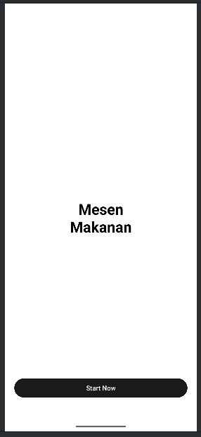
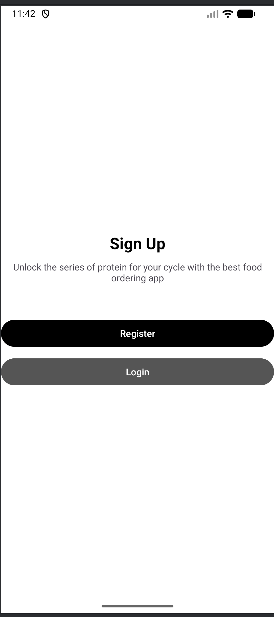
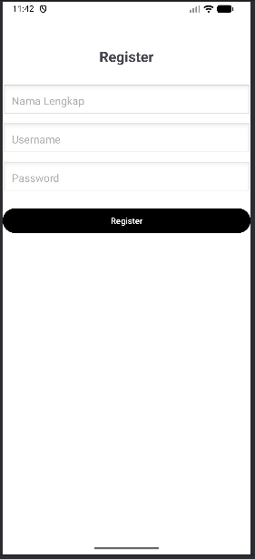
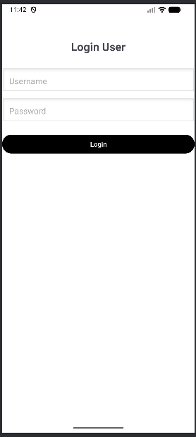
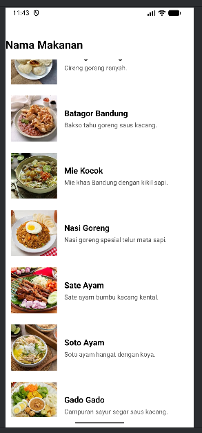
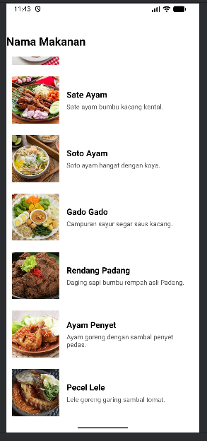
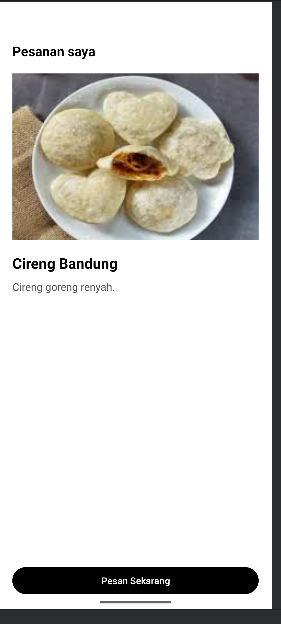
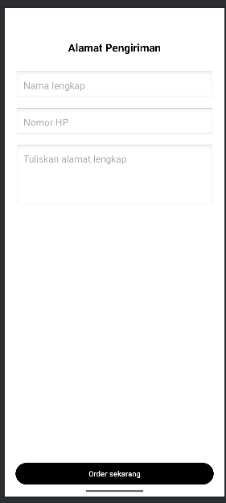
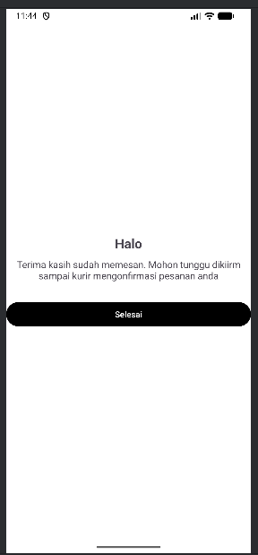

# Aplikasi Pemesanan Makanan Sederhana

Ujian Tengah Semester Mata Kuliah: Pengembangan Aplikasi Mobile (Semester 5)

## Penjelasan Singkat
Aplikasi ini adalah prototipe sistem pemesanan makanan yang terdiri dari 8 layar utama. Fitur utama meliputi:
* **Sistem Autentikasi**: Halaman Login dan Register untuk masuk ke aplikasi.
* **Daftar Menu**: Menampilkan lebih dari 10 menu makanan menggunakan `RecyclerView` yang efisien.
* **Detail Pesanan**: Menampilkan informasi lengkap makanan yang dipilih (Nama, Gambar, Deskripsi).
* **Manajemen Alamat**: Form penginputan data pengiriman pelanggan.
* **Konfirmasi**: Halaman akhir sebagai tanda pesanan telah diterima.

## Teknologi yang Digunakan
* **Bahasa Pemrograman**: Kotlin
* **IDE**: Android Studio Ladybug (atau versi yang Anda gunakan)
* **Library AndroidX**: Core-KTX, AppCompat, Activity, ConstraintLayout.
* **UI Component**: Material Design, RecyclerView, Intent (Explicit).

## Tampilan Aplikasi

| Screen 1 - Start | Screen 2 - Auth | Screen 3 - Login | Screen 4 - Register |
|---|---|---|---|
|  |  |  |  |

| Screen 5 - Menu (Atas) | Screen 5 - Menu (Scroll) | Screen 6 - Detail |
|---|---|---|
|  |  |  |

| Screen 7 - Alamat | Screen 8 - Selesai |
|---|---|
|  |   |

